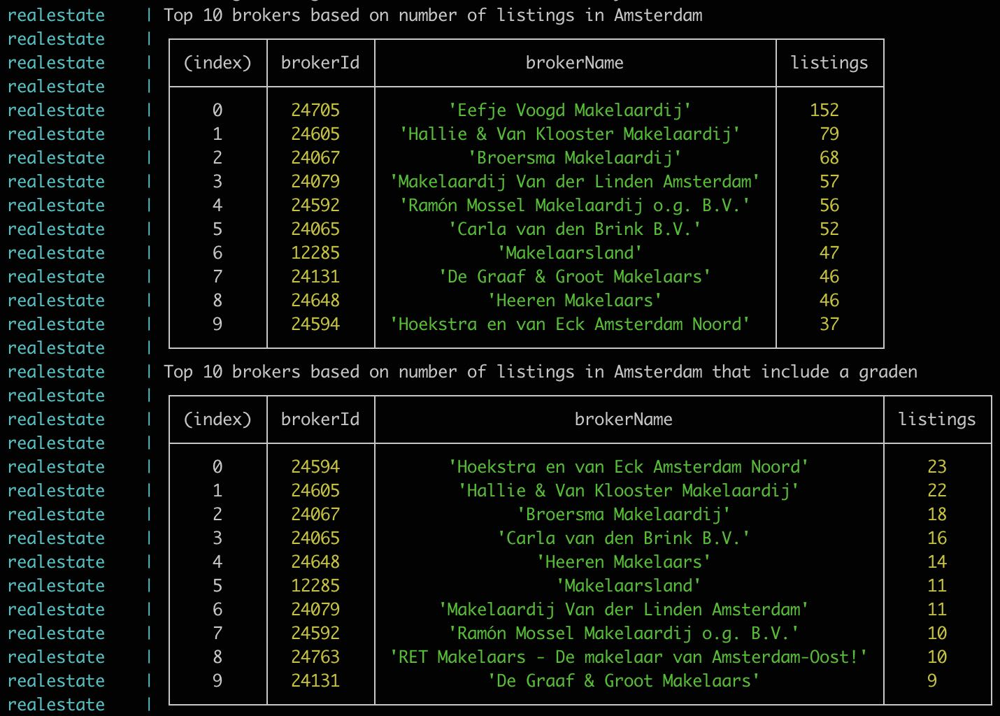

# Returns the top x brokers based on the amount of listings

## Running the project

### Prerequisites

* Make sure docker is installed https://www.docker.com/get-started
* Make sure docker-compose is installed https://docs.docker.com/compose/install/

### Running the service in dev env

* Add the funda API key in the config/dev.yml file
* Run `./bin/start.sh --build` in your terminal

When to service is done you should see something like this:

## Running the tests

* Run `./bin/test.sh --build` in your terminal
